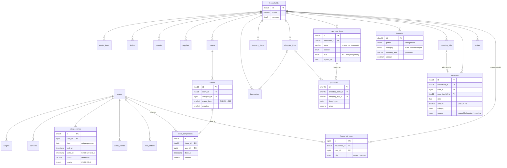

# 🏠 Home Helper API

**Shared household sync for [Personal Home Helper](https://github.com/kgiannopoulou/personal-home-helper).** The Expo app keeps working offline on the phone; this Laravel app gives a household one shared copy of its money, kitchen, shopping, chores and planner, so two phones (and a browser dashboard) see the same list.

| | |
|---|---|
| **Backend** | Laravel 13, PHP 8.4, Pest |
| **Database** | MySQL 8.4 (normalized schema, foreign keys, CHECK constraints, generated columns) |
| **Dashboard** | Inertia + React 19 + TypeScript (Laravel React starter kit) |
| **Infra** | Docker (Laravel Sail: MySQL + Redis) |

## Roadmap

| Phase | What | Status |
|---|---|---|
| 0 | Tools, Laravel app with React starter kit, Sail | ✅ |
| 1 | MySQL schema: 23 household tables, models, factories, 6-month demo seeder | ✅ |
| 2 | REST API: Sanctum tokens, households, signed invites, 20 module resources, policies | ✅ |
| 3 | Insights in SQL: window functions, CTEs, a view, `EXPLAIN ANALYZE` before/after | ✅ |
| 4 | Sync between phones: last write wins, tombstones, a server-clock cursor | ✅ |
| 5 | Queues and scheduler: recurring bills, reminders, push | |
| 6 | React dashboard | |
| 7 | Oracle lab: partitioning, archiving, RMAN | |

## API

JSON over HTTPS with a Sanctum bearer token. Every module lives under one household, and the API only ever returns rows of households you belong to.

```http
POST /api/login            {email, password, device_name}  → {token, user}
POST /api/logout                                            revokes this token
GET  /api/me                                                you + your households

GET  /api/households                                        yours, with your role
POST /api/households       {name, currency}                 you become the owner
GET  /api/households/{household}/members
POST /api/households/{household}/invites   {email}          owner only; emails a signed link
POST /api/invites/{invite}/accept?expires=…&signature=…     the link from the email

GET|POST            /api/households/{household}/{module}
GET|PUT|PATCH|DELETE /api/households/{household}/{module}/{id}
```

**Modules:** `expenses`, `recurring-bills`, `budgets`, `inventory-items`, `purchases`, `shopping-items`, `shopping-trips`, `item-prices`, `rooms`, `chores`, `chore-completions`, `supplies`, `food-entries`, `water-entries`, `sleep-entries`, `workouts`, `weights`, `events`, `todos`, `admin-items`.

Lists are paginated (`?per_page=`, at most 100) and newest first. Dated modules filter with `?from=2026-09-01&to=2026-09-30` (both days included).

```bash
TOKEN=$(curl -s -X POST localhost:8000/api/login -H 'Accept: application/json' \
  -d email=demo@homehelper.test -d password=password | jq -r .token)
curl -s localhost:8000/api/households -H "Authorization: Bearer $TOKEN" | jq
curl -s "localhost:8000/api/households/{id}/expenses?from=2026-07-01&to=2026-07-31" -H "Authorization: Bearer $TOKEN" | jq
```

### How access is enforced

- **Route:** `can:view,household`. If you aren't a member, every URL under that household is **403**.
- **Query:** rows are always looked up through the household's relation, so another household's row under your household's URL is **404**. It is never loaded, so nothing about it can leak.
- **Policies:** one per model (`app/Policies`), sharing `HouseholdDataPolicy`. Food, water, sleep, workouts and weight use `PersonalDataPolicy`: other members of your household can't see them either.
- **Validation:** ids in a body (`recurring_bill_id`, `room_id`, `assignee_id`…) must belong to the same household, so nobody can link to another household's rows.
- **Ownership:** `household_id` and `user_id` are never taken from the body. They come from the URL and the token.

### Conventions

- **One Form Request per module** (`app/Http/Requests/Api`), written as the rules for creating a row. `PATCH` turns `required` into `sometimes`, except for fields checked together, like bed and wake times.
- **Times** are ISO 8601 with an offset and are stored in UTC. Calendar days are plain `YYYY-MM-DD`.
- **Errors:** 422 for validation, 409 when a unique key clashes (the same item name twice), 403 when you aren't a member, 404 when a row isn't in this household. A CHECK constraint that validation missed becomes 422, not 500.
- **Controllers** per module are a few lines each. Their shared behaviour (scoping, filters, pagination, policies) lives in `HouseholdDataController`.

## Sync between phones

The phone stays offline-first: its own storage is the copy you use, and it swaps changes with the server whenever it can. The app side lives in [personal-home-helper](https://github.com/kgiannopoulou/personal-home-helper) (`src/shared/sync`).

```http
POST /api/households/{household}/sync
{
  "since": "2026-10-03T12:00:00.000+00:00",          // null the first time
  "changes": {
    "shopping_items": [{ "id": "01k6…", "name": "Milk", "category": "drinks", "checked": false, "updated_at": "2026-10-03T12:04:31.120Z" }],
    "inventory_items": [{ "id": "01k5…", "updated_at": "2026-10-03T12:05:00.000Z", "deleted_at": "2026-10-03T12:05:00.000Z" }]
  }
}
→ { "since": "…", "changes": { "chores": [ … ] }, "remapped": { "rooms": { "phone-id": "server-id" } }, "rejected": [ … ] }
```

The 17 synced collections are `recurring_bills`, `expenses`, `shopping_trips`, `shopping_items`, `inventory_items` (with their purchase days), `rooms`, `chores`, `chore_completions`, `supplies`, `events`, `todos`, `admin_items`, and, only your own, `food_entries`, `water_entries`, `sleep_entries`, `workouts`, `weights`.

**Rules** (`app/Sync/SyncService.php`, one DB transaction):

- **Last write wins** on `updated_at`, the time the row changed *on the device*. An older change never overwrites a newer one. A tie keeps what's stored, so every phone ends up with the same row. A device clock in the future is capped at the server's time, so it can't win every conflict.
- **Deletes are tombstones:** a row arrives with `deleted_at` set and is soft-deleted, so the other phones hear about it.
- **Two clocks.** `updated_at` decides conflicts. `synced_at`, set by MySQL (`DEFAULT CURRENT_TIMESTAMP(3) ON UPDATE …`) on every write, is the cursor. "Changed since my last sync" uses MySQL's clock, so a phone whose clock is behind can't hide its changes. The reply's `since` starts 5 seconds early, so a row still being committed can't fall between two syncs. Getting a row twice is harmless.
- **The same thing made on two phones becomes one.** Both phones start with a "Kitchen" room, or both add this month's rent from the same bill. A new id with the same natural key (`rooms.name`, `inventory_items.name`, `chores (room_id, name)`, `expenses (recurring_bill_id, date)`, a night of sleep's `date`…) joins the existing row, and the reply tells the phone to rename its id (`remapped`). Rows later in the same request that point to it (a chore in that room) follow.
- **Safety:** every row is validated with the same Form Request rules as the REST API, and ids it points to must be in the same household. An id belonging to another household is refused (`forbidden`) and never touched. One bad row is refused on its own (`rejected`), and the rest of the batch still syncs.

Tests: `tests/Feature/Api/SyncTest.php` covers last write wins (older, tie, newer from another time zone, an older deletion), tombstones reaching the other phone, the `since` cursor and its overlap, joining "Kitchen" and the rent, sleep replacing a night, purchase days, future clocks, and refusals.

## Insights: trends and predictions in SQL

The phone works these out in TypeScript (`predictions.ts`, `history.ts`, `inventory.ts`). Here they are MySQL 8 queries, one class each in `app/Queries`, with the same rules and the same test cases as the app's Jest tests.

| `GET /api/households/{household}/insights/…` | What it answers | SQL |
|---|---|---|
| `weekly-spending?weeks=8` | Spending per Monday week and category, against the week before | the `v_weekly_spending` view (`GROUP BY YEARWEEK(date, 1)`), a CTE, `LAG()` over each category |
| `run-out` | When each kitchen item runs out, from how often it's bought | `SELECT DISTINCT` days, `LAG()` + `DATEDIFF()`, `AVG()` of the gaps, `HAVING COUNT(gap) >= 2` |
| `slipping-chores` | Chores whose last 3 gaps all ran 30% late (or early), and a better frequency | `LAG()` and `ROW_NUMBER()` over completion days, a `UNION ALL` row for "overdue right now", the median of 3 as `SUM − MIN − MAX`, a frequencies CTE |
| `shopping-day` | Your usual shopping weekday and when it next comes round | `UNION` of trips and grocery spends, `DAYOFWEEK()`, `COUNT(*)` with `SUM(COUNT(*)) OVER ()` for the share, `ROW_NUMBER()` to rank, last 12 weeks |
| `budget-forecast` | Where this month ends | CTEs for this month, the last 3 months by the same day and in all, the budget; bills aren't extrapolated |

Example: run-out, the query in `app/Queries/RunOutQuery.php`:

```sql
WITH params AS (SELECT ? AS household_id, CAST(? AS DATE) AS today),
days AS (                          -- two purchases on one day count once
    SELECT DISTINCT pu.inventory_item_id, pu.bought_on
    FROM purchases pu JOIN params p ON pu.household_id = p.household_id
    WHERE pu.deleted_at IS NULL
),
gaps AS (
    SELECT inventory_item_id, bought_on,
           DATEDIFF(bought_on, LAG(bought_on) OVER (PARTITION BY inventory_item_id ORDER BY bought_on)) AS gap_days
    FROM days
),
rhythm AS (
    SELECT inventory_item_id, MAX(bought_on) AS last_bought, COUNT(*) AS times_bought,
           GREATEST(1, ROUND(AVG(gap_days))) AS every_days
    FROM gaps GROUP BY inventory_item_id
    HAVING COUNT(gap_days) >= 2    -- at least 3 purchase days, like the app
)
SELECT i.id, i.name, i.level, r.last_bought, r.times_bought, r.every_days,
       r.last_bought + INTERVAL r.every_days DAY AS runs_out_on,
       DATEDIFF(r.last_bought + INTERVAL r.every_days DAY, p.today) AS days_left
FROM rhythm r
JOIN inventory_items i ON i.id = r.inventory_item_id AND i.deleted_at IS NULL
CROSS JOIN params p
ORDER BY runs_out_on, i.name;
```

"Today" is always a binding, never `CURDATE()`, so tests can pin the day and the server's time zone doesn't matter.

### EXPLAIN ANALYZE: before and after

Measured on benchmark data: the demo household copied 500 times (`php artisan db:seed --class=BenchmarkSeeder`, done in SQL with a recursive CTE and `INSERT … SELECT`). That makes 93,000 expenses, 83,500 purchases and 189,000 chore completions. `php artisan insights:explain before|after` saves every plan to [`docs/explain/`](docs/explain).

| Query | Before | After | What changed |
|---|---:|---:|---|
| weekly-spending | **521 ms** | **0.37 ms** | query rewrite + covering index |
| run-out | 1.2 ms | 0.72 ms | covering index |
| budget-forecast | 2.7 ms | 1.9 ms | covering index (timed: see below) |
| slipping-chores | 3.8 ms | 3.8–5 ms | already used `(chore_id, done_at)` |
| shopping-day | 0.14 ms | 0.16 ms | already used `(household_id, category, date)` and `(household_id, date)` |

**Weekly spending: 1,400× faster.** Before, MySQL grouped *every household's* expenses into a 64,629-row temporary table, twice:

```
-> Nested loop left join   (521 ms, 39 rows)
    -> Index lookup on v using <auto_key0> (household_id='01m4…')   (255 ms, 129 rows)
        -> Materialize   (255 ms, 64629 rows)
            -> Aggregate using temporary table   (147 ms, 64629 rows)
                -> Table scan on expenses   (18.3 ms, 93186 rows)
    -> Index lookup on v using <auto_key0> (household_id=p.household_id, week_start=…)
        -> Materialize   (266 ms, 64629 rows)          ← the same again, for "the week before"
            -> Table scan on expenses   (18.2 ms, 93186 rows)
```

There were two causes:

1. **The household id came from a join to a `params` CTE.** MySQL pushes a condition down into a grouped view only when it's a constant. The rewrite binds `v.household_id = ?` directly ([`weekly-spending.rewrite.txt`](docs/explain/weekly-spending.rewrite.txt): 0.52 ms).
2. **The view was read twice.** "The week before" was a self-join, and the second read didn't get the pushdown. `LAG() OVER (PARTITION BY category ORDER BY week_start)` reads it once. It only counts when the previous row really is 7 days earlier.

Then a covering index, `expenses (household_id, date, category, amount, source, deleted_at)`, lets MySQL answer from the index alone. It replaces `(household_id, date)`, which it starts with:

```
-> Sort: compared.week_start, compared.total DESC, compared.category   (0.366 ms, 39 rows)
    -> Window aggregate with buffering: lag(weeks.week_start) OVER w, lag(weeks.total) OVER w   (0.328 ms, 44 rows)
        -> Aggregate using temporary table   (0.172 ms, 44 rows)
            -> Covering index lookup on expenses using expenses_household_date_covering (household_id='01m4…')
```

**Run-out:** before, it went through the sync index `(household_id, updated_at)` and then to each row to check `deleted_at`. `purchases (household_id, inventory_item_id, bought_on, deleted_at)` makes that a covering index lookup:

```
before  -> Index lookup on pu using purchases_household_id_updated_at_index (household_id='01m4…')
after   -> Covering index lookup on pu using purchases_household_item_day_covering (household_id='01m4…')
```

**Budget forecast:** every CTE returns one row, so MySQL works the whole query out while planning. `EXPLAIN ANALYZE` only shows `Rows fetched before execution`. The classic `EXPLAIN` shows the expense reads changing from `ref expenses_household_id_updated_at_index` to `range expenses_household_date_covering … Using index`. Averaged over 20 runs, it went from 2.7 to 1.9 ms.

## Database

Every row belongs to a **household**. Shared data (money, kitchen, shopping, chores, planner) has a `household_id`; personal logs (food, water, sleep, workouts, weight) also have a `user_id`.



Every synced table also has `created_at`, `updated_at`, `deleted_at` (millisecond precision) and an index on `(household_id, updated_at)` for the sync pull in Phase 4.

### Design decisions

- **ULID primary keys** (`char(26)`). The phone creates rows while offline, so it has to make ids itself. ULIDs sort by time, so new rows land at the end of the index. Users keep `bigint` ids from the Laravel starter kit, because only the server creates them.
- **Arrays became tables.** On the phone each kitchen item holds a `purchases: string[]` and each chore a `lastDone`. Here, `purchases` and `chore_completions` are their own tables, so "when was this last bought?" or "who did most of the chores this month?" is a query, not a loop in JavaScript.
- **Every price is kept.** The phone remembers only the last price per item; `item_prices` keeps each one, so price changes can be tracked over time (Phase 3).
- **`DECIMAL(10,2)` for money**, `DATE` for calendar days, `TIMESTAMP(3)` for moments. Food and water keep both a `date` (the local day) and a timestamp, so a meal never moves to another day because of time zones.
- **Unique keys that work with soft deletes.** `(household_id, name)` on inventory would stop you adding "Milk" again after deleting it, because the deleted row is still there. These tables have a generated column `alive` (1 while live, NULL once deleted) at the end of the unique key, and MySQL never treats two NULLs as equal.
- **One overall budget per period.** `budgets.category` is NULL for the whole budget, and for the same NULL reason the unique key uses a generated `category_key = coalesce(category, 'all')`.
- **CHECK constraints** catch impossible values in the database itself, not only in validation: no negative amounts, bills on day 1–28, sleep quality 1–5, waking after going to bed, and so on. MySQL also works out `sleep_entries.hours` from the two times, so it can't disagree with them.
- **Delete rules.** Deleting a household cascades to all its data. Deleting a user keeps the household's money and chores (`user_id` becomes NULL), but deletes that user's personal food, sleep and weight logs.
- **Enums in one place.** PHP enums (`app/Enums`) feed both the migration `enum` columns and the model casts.
- **`household_id` is never mass-assignable.** Rows get their household from the relation (`$household->expenses()->create(...)`), never from request input.

### Demo data

`DemoSeeder` builds one household with 6 months of data up to today. It always uses the same random seed:

- a weekly shop **every Saturday** (one in eight skipped), with milk weekly, eggs every 2 weeks, olive oil every 6 weeks, and prices that creep up
- rent and bills on their day each month
- **one month over budget**: the washing machine broke three months ago
- **"Clean the oven"** set to every 14 days but done only every 3–5 weeks
- food, water, sleep, workouts and a slowly falling weight for the owner; events, to-dos and life admin

Log in as `demo@homehelper.test` / `password`.

## Run it

### With Sail (Linux, macOS, WSL 2)

```bash
composer install && npm install
cp .env.example .env && php artisan key:generate   # then set DB_HOST=mysql and REDIS_HOST=redis
./vendor/bin/sail up -d
./vendor/bin/sail artisan migrate:fresh --seed
./vendor/bin/sail npm run dev          # http://localhost
```

### On Windows without WSL

PHP 8.4 and Composer run natively, and Docker runs only the databases:

```bash
composer install && npm install
cp .env.example .env && php artisan key:generate
docker compose up -d mysql redis       # .env.example already points at 127.0.0.1
php artisan migrate:fresh --seed
composer run dev                       # http://localhost:8000
```

To use it from a phone, set `APP_URL` to an address the phone can reach (for example `http://192.168.1.20:8000`, with `php artisan serve --host=0.0.0.0`), because invite links are built from it. With `MAIL_MAILER=log`, invite emails go to `storage/logs/laravel.log`.

### Tests

```bash
php artisan test                       # or ./vendor/bin/sail test
```

The tests run against the real MySQL `testing` database (Sail creates it), so the foreign keys, CHECK constraints and generated columns are tested too. `tests/Feature/Database/SchemaTest.php` covers cascades, constraints, unique keys with soft deletes, and the demo seeder's story. `tests/Feature/Insights` checks the exact numbers of every insight query, using the same cases as the app's Jest tests.

The API tests (`tests/Feature/Api`) run the same checks on every module: list, create, invalid input, update, delete, and that another household's rows are refused (403 for the household URL, 404 for a row under yours). Another test makes sure a real token from another household is refused too. Separate tests cover login, logout and rate limiting, households and signed invites (tampered, expired, wrong person, used twice), date filters and pagination, private personal logs, cross-household ids, 409 conflicts and UTC times.

Check the keys yourself:

```sql
SHOW CREATE TABLE expenses;
```
