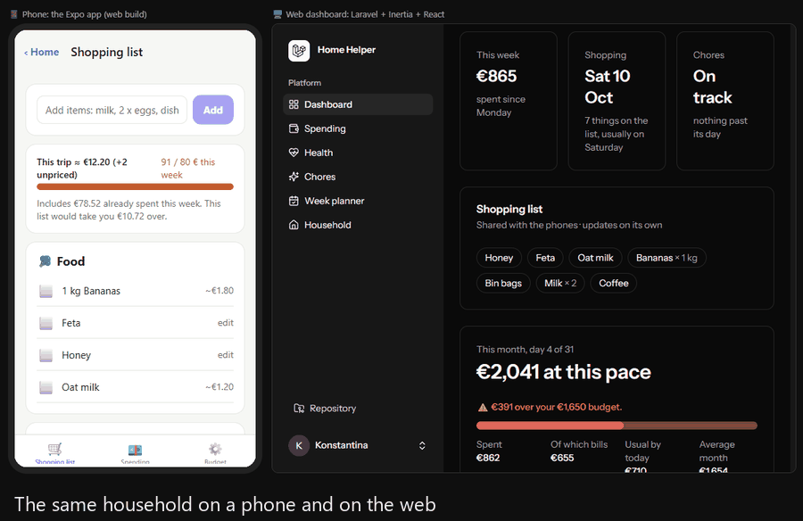
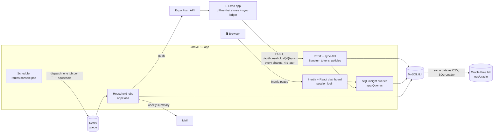

# 🏠 Home Helper API

[](https://github.com/kgiannopoulou/home-helper-api/actions/workflows/tests.yml)

**The shared household server for [Personal Home Helper](https://github.com/kgiannopoulou/personal-home-helper)**, an offline-first Expo app for money, kitchen, shopping, chores, health and planning. This Laravel app gives a household one shared copy of its data. It has a sync API for the phones, scheduled jobs that push to them, and a React dashboard for the browser, all on MySQL. An Oracle lab runs the same data through partitioning, backup and recovery.



*Yoghurt is added on the phone (the Expo app's web build, left) and appears on the web dashboard (right) 16 seconds later. The phone syncs 4 s after a change, and the dashboard refreshes every 10 s.*

## In two minutes

| What the job asks for | Where it is |
|---|---|
| **PHP, Laravel** | A REST and sync API with Sanctum tokens, policies and Form Requests ([API](#api), [Sync](#sync-between-phones)). Queued jobs on Redis with the scheduler, Expo push, a Mailable ([Jobs](#scheduled-jobs-and-push)). 268 Pest tests on real MySQL |
| **MySQL** | 24 normalized household tables with foreign keys, CHECK constraints, generated columns and soft-delete-safe unique keys ([Database](#database)). Window functions, CTEs, a view, and **`EXPLAIN ANALYZE` before and after** an index and a rewrite: [1,400× faster](#insights-trends-and-predictions-in-sql) |
| **React** | Inertia + React + TypeScript pages with Recharts: spending, health, chores, a week planner whose Apply runs in one transaction, and the household ([Web dashboard](#web-dashboard)). Vitest + React Testing Library. Plus the [React Native app](https://github.com/kgiannopoulou/personal-home-helper) |
| **Oracle basics** | Oracle Free in Docker: interval partitions and pruning, ARCHIVELOG mode, `EXCHANGE PARTITION` archiving, RMAN level 0/1, Data Pump, and four timed recovery drills. **[The runbook](ops/oracle/RUNBOOK.md)** has every command and its output |
| **CI** | GitHub Actions on every push: MySQL 8.4 service, migrate, Pint, Pest, the production build, `tsc`, Vitest ([workflow](.github/workflows/tests.yml)) |

## Architecture



- **The phone stays offline-first.** It keeps its own copy and swaps changes with `POST …/sync`: last write wins on the device's time, deletions travel as tombstones, and a cursor runs on the server's clock.
- **The browser** logs in with the same account and reads the same rows through the same SQL query classes as the API.
- **The scheduler** queues one job per household on Redis: fill the shopping list the day before shopping day, add bills, learn chore frequencies, budget alerts, a Sunday summary. The jobs push to the phones through Expo.
- **[Oracle lab](ops/oracle/RUNBOOK.md):** the same data in Oracle Database Free, for partitioning, archiving, RMAN and recovery drills.

| | |
|---|---|
| **Backend** | Laravel 13, PHP 8.4, Pest |
| **Database** | MySQL 8.4 (normalized schema, foreign keys, CHECK constraints, generated columns); Oracle AI Database 26ai Free (lab) |
| **Dashboard** | Inertia + React 19 + TypeScript (Laravel React starter kit), Recharts, Vitest + React Testing Library |
| **Infra** | Docker (Laravel Sail: MySQL + Redis), Redis queues, the Laravel scheduler, Expo push, GitHub Actions |
| **The phone app** | [personal-home-helper](https://github.com/kgiannopoulou/personal-home-helper): Expo SDK 57, React Native, TypeScript |

## Roadmap

| Phase | What | Status |
|---|---|---|
| 0 | Tools, Laravel app with React starter kit, Sail | ✅ |
| 1 | MySQL schema: 23 household tables, models, factories, 6-month demo seeder | ✅ |
| 2 | REST API: Sanctum tokens, households, signed invites, 20 module resources, policies | ✅ |
| 3 | Insights in SQL: window functions, CTEs, a view, `EXPLAIN ANALYZE` before/after | ✅ |
| 4 | Sync between phones: last write wins, tombstones, a server-clock cursor | ✅ |
| 5 | Queues and scheduler: shopping list, bills, budget alerts, weekly summary, push | ✅ |
| 6 | React dashboard: spending, health, chores, week planner, household | ✅ |
| 7 | Oracle lab: interval partitions, ARCHIVELOG and data archiving, RMAN, Data Pump, four recovery drills | ✅ |
| 8 | CI on every push, this README, the demo | ✅ |

## API

JSON over HTTPS with a Sanctum bearer token. Every module lives under one household, and the API only ever returns rows of households you belong to.

```http
POST /api/login            {email, password, device_name}  → {token, user}
POST /api/logout                                            revokes this token
GET  /api/me                                                you + your households
POST   /api/devices        {token, platform, name}          this phone's Expo push token
DELETE /api/devices        {token}                          no more pushes to it (logout does this too)

GET  /api/households                                        yours, with your role
POST /api/households       {name, currency}                 you become the owner
GET  /api/households/{household}/members
POST /api/households/{household}/invites   {email}          owner only; emails a signed link
POST /api/invites/{invite}/accept?expires=…&signature=…     the link from the email

GET|POST            /api/households/{household}/{module}
GET|PUT|PATCH|DELETE /api/households/{household}/{module}/{id}
```

**Modules:** `expenses`, `recurring-bills`, `budgets`, `inventory-items`, `purchases`, `shopping-items`, `shopping-trips`, `item-prices`, `rooms`, `chores`, `chore-completions`, `supplies`, `food-entries`, `water-entries`, `sleep-entries`, `workouts`, `weights`, `events`, `todos`, `admin-items`.

Lists are paginated (`?per_page=`, at most 100) and newest first. Dated modules filter with `?from=2026-09-01&to=2026-09-30` (both days included).

```bash
TOKEN=$(curl -s -X POST localhost:8000/api/login -H 'Accept: application/json' \
  -d email=demo@homehelper.test -d password=password | jq -r .token)
curl -s localhost:8000/api/households -H "Authorization: Bearer $TOKEN" | jq
curl -s "localhost:8000/api/households/{id}/expenses?from=2026-07-01&to=2026-07-31" -H "Authorization: Bearer $TOKEN" | jq
```

### How access is enforced

- **Route:** `can:view,household`. If you aren't a member, every URL under that household is **403**.
- **Query:** rows are always looked up through the household's relation, so another household's row under your household's URL is **404**. It is never loaded, so nothing about it can leak.
- **Policies:** one per model (`app/Policies`), sharing `HouseholdDataPolicy`. Food, water, sleep, workouts and weight use `PersonalDataPolicy`: other members of your household can't see them either.
- **Validation:** ids in a body (`recurring_bill_id`, `room_id`, `assignee_id`…) must belong to the same household, so nobody can link to another household's rows.
- **Ownership:** `household_id` and `user_id` are never taken from the body. They come from the URL and the token.

### Conventions

- **One Form Request per module** (`app/Http/Requests/Api`), written as the rules for creating a row. `PATCH` turns `required` into `sometimes`, except for fields checked together, like bed and wake times.
- **Times** are ISO 8601 with an offset and are stored in UTC. Calendar days are plain `YYYY-MM-DD`.
- **Errors:** 422 for validation, 409 when a unique key clashes (the same item name twice), 403 when you aren't a member, 404 when a row isn't in this household. A CHECK constraint that validation missed becomes 422, not 500.
- **Controllers** per module are a few lines each. Their shared behaviour (scoping, filters, pagination, policies) lives in `HouseholdDataController`.

## Sync between phones

The phone stays offline-first: its own storage is the copy you use, and it swaps changes with the server whenever it can. The app side lives in [personal-home-helper](https://github.com/kgiannopoulou/personal-home-helper) (`src/shared/sync`).

```http
POST /api/households/{household}/sync
{
  "since": "2026-10-03T12:00:00.000+00:00",          // null the first time
  "changes": {
    "shopping_items": [{ "id": "01k6…", "name": "Milk", "category": "drinks", "checked": false, "updated_at": "2026-10-03T12:04:31.120Z" }],
    "inventory_items": [{ "id": "01k5…", "updated_at": "2026-10-03T12:05:00.000Z", "deleted_at": "2026-10-03T12:05:00.000Z" }]
  }
}
→ { "since": "…", "changes": { "chores": [ … ] }, "remapped": { "rooms": { "phone-id": "server-id" } }, "rejected": [ … ] }
```

The 18 synced collections are `recurring_bills`, `expenses`, `shopping_trips`, `shopping_items`, `inventory_items` (with their purchase days), `rooms`, `chores`, `chore_completions`, `supplies`, `events`, `todos`, `admin_items`, and, only your own, `food_entries`, `water_entries`, `sleep_entries`, `workouts`, `step_counts`, `weights`.

**Steps** are kept on the phone as `{ "2026-10-04": 8123 }`, without ids. A day's id is made from the person and the day (`StepCount::idFor()` here, `stepsId()` on the phone: a ULID whose time is midnight UTC of the day and whose random part is the user id), so every phone of that person makes the same id and a day is never stored twice. Only finished days sync; today's count changes with every few steps.

**Rules** (`app/Sync/SyncService.php`, one DB transaction):

- **Last write wins** on `updated_at`, the time the row changed *on the device*. An older change never overwrites a newer one. A tie keeps what's stored, so every phone ends up with the same row. A device clock in the future is capped at the server's time, so it can't win every conflict.
- **Deletes are tombstones:** a row arrives with `deleted_at` set and is soft-deleted, so the other phones hear about it.
- **Two clocks.** `updated_at` decides conflicts. `synced_at`, set by MySQL (`DEFAULT CURRENT_TIMESTAMP(3) ON UPDATE …`) on every write, is the cursor. "Changed since my last sync" uses MySQL's clock, so a phone whose clock is behind can't hide its changes. The reply's `since` starts 5 seconds early, so a row still being committed can't fall between two syncs. Getting a row twice is harmless.
- **The same thing made on two phones becomes one.** Both phones start with a "Kitchen" room, or both add this month's rent from the same bill. A new id with the same natural key (`rooms.name`, `inventory_items.name`, `chores (room_id, name)`, `expenses (recurring_bill_id, date)`, a night of sleep's `date`…) joins the existing row, and the reply tells the phone to rename its id (`remapped`). Rows later in the same request that point to it (a chore in that room) follow.
- **Safety:** every row is validated with the same Form Request rules as the REST API, and ids it points to must be in the same household. An id belonging to another household is refused (`forbidden`) and never touched. One bad row is refused on its own (`rejected`), and the rest of the batch still syncs.

Tests: `tests/Feature/Api/SyncTest.php` covers last write wins (older, tie, newer from another time zone, an older deletion), tombstones reaching the other phone, the `since` cursor and its overlap, joining "Kitchen" and the rent, sleep replacing a night, purchase days, future clocks, and refusals.

## Web dashboard

The browser side of the same Laravel app: Inertia pages in React and TypeScript, built on the starter kit's layout and components. A controller runs the Phase 3 SQL queries and hands the rows to the page as props, so there is no second API to keep in step with the phone.

```php
// app/Http/Controllers/Web/SpendingController.php
return Inertia::render('spending', [
    'spending' => (new WeeklySpendingQuery($household, $today, $weeks))->get(),
    'forecast' => (new BudgetForecastQuery($household, $today))->get(),
]);
```

| Page | What it shows | Where the numbers come from |
|---|---|---|
| **Dashboard** | This week's spending, the next shopping day, overdue chores, the month's forecast | `WeeklySpendingQuery`, `ShoppingDayQuery`, `OverdueChoresQuery`, `BudgetForecastQuery` |
| **Spending** | Spending per week stacked by category (4, 8, 12 or 26 weeks), the month's forecast against the budget | `WeeklySpendingQuery`, `BudgetForecastQuery` |
| **Health** | Your sleep, steps and workouts per week, as three charts (hours, steps and minutes don't share an axis) | `HealthWeeksQuery`: a recursive CTE makes the weeks, so an empty week is still on the chart. Only your own rows |
| **Chores** | Overdue chores, chores that keep slipping and a better frequency, a fair-share chart of minutes per member | `OverdueChoresQuery`, `SlippingChoresQuery`, `FairShareQuery` (`SUM() OVER ()` for each share) |
| **Week planner** | Next week's chores, meals and errands placed in free time around the calendar, with checkboxes and **Apply** | `app/Planning/WeekPlanner.php` |
| **Household** | Members, waiting invites, an invite form (owner), switching household, starting a new one | the same `InviteMember` action as the API |

- **The same household as on the phone.** The dashboard uses the normal session login with the same account. It shows your first household (or the one you switched to, kept in the session). The phone sends the household in every URL instead. A household you aren't a member of is 403, like the API.
- **The week planner.** Chores fall on the day they come due (overdue ones on Monday). Meals use up what expires that week, the evening before it does. Errands are open to-dos and life admin due by the end of the week. Free time is the evening on weekdays and the day at weekends, minus calendar events, and an all-day event takes the whole day. An item that doesn't fit moves to the next day with room, then an earlier one. What fits nowhere is listed.
- **Apply is one transaction.** The browser sends only the keys of the ticked items (`chore:{id}:{date}`, `meal:{date}`, `todo:{id}`). The server works the plan out again, so times can't be made up in the browser. If the plan changed since the page opened, nothing is saved and you're asked to reload. Each item becomes a calendar event, which the phones get on their next sync, and a planned to-do gets that day as its due date. If one write fails, the whole transaction is rolled back. Applying twice doesn't add an event twice, and an applied item keeps its time in the plan instead of becoming busy time to plan around.
- **Forms** use Inertia's `useForm` (Apply, invites, a new household), and the page state uses React hooks (`useState` for the meal, chore and errand filters).
- **Charts** (Recharts) use colours checked for colour-blind separation in light and dark mode. Each spending category always has the same colour, and rarer categories share a grey "Other". Every chart has **Show as table** with the same numbers, and there is never a second y-axis.

Tests: `tests/Feature/Web` checks each page's props (`assertInertia`), membership and switching, invites, and the planner's rules: free time, events, all-day events, meals, overdue chores, what doesn't fit, a daily chore moving off a full day. It also tests Apply: times at home, twice, a stale plan, another household's keys, and the rollback when the second write fails. In the browser, `npm test` runs Vitest with React Testing Library (`resources/js/test`): the planner's ticks and what Apply sends, the spending page's forecast states and its table, and the chart helpers.

## Scheduled jobs and push

On the phone, the list filled itself only if someone opened the app the day before shopping day. Here the work runs on Laravel's scheduler and a Redis queue, so it happens on time with every phone closed, and a push tells the household.

| Job (`app/Jobs`) | When (at home) | What it does |
|---|---|---|
| `ApplyRecurringBills` | daily 06:00 | Adds each active bill as an expense once its day of the month has come. A missed day is caught up later in the month; past months are never backfilled. A deleted bill expense stays deleted. |
| `LearnChoreFrequencies` | daily 04:00 | Chores done 30% late (or early) 3 times running move one step along the frequencies (the `slipping-chores` query). The old frequency is kept, so the phone can offer Undo. |
| `PrepareShoppingList` | daily 17:00 | The day before the usual shopping day (`shopping-day`), adds what's low or empty and what runs out before the shop after it (`run-out`), skipping what's already listed (same name matching as the phone). Push: *"🛒 Tomorrow is Saturday shopping · Added Eggs, Milk and Dish soap to the list."* |
| `BudgetAlert` | daily 18:00 | When `budget-forecast` goes over the monthly budget, a push: *"At this pace: €1,395 of €1,000 this month, €395 over."* Once a month, and again only if the overshoot grows by another 10% of the budget. |
| `WeeklySummary` | Sunday 19:00 | An email (a Markdown `Mailable`) and a push to each member: spending this week, the month's pace, overdue chores and chores that changed frequency, and **their own** protein, fibre and water gaps (`NutritionGapsQuery`). Nobody sees another member's food. |

```php
// routes/console.php
Schedule::job(new PrepareShoppingList)->dailyAt('17:00')->timezone($home)->onOneServer();
```

- **One job per household.** The scheduled run only fans out: it queues one copy per household, all for the same date (`HouseholdJob`), so a run that starts at 23:59 and ends after midnight keeps its day, households run side by side on the workers, and one failing doesn't stop the rest. Each failed one is retried (3 tries, back off 1 then 5 minutes).
- **Home time.** `HOME_TIMEZONE` sets both when jobs run and what "today" is. The queries take today as a binding (Phase 3), so they don't depend on the server's clock.
- **Safe to run twice.** Bills are added once per month, the list skips what's on it (so a second run adds nothing and sends no push), and a learned chore isn't touched again for 3 cycles.
- **`job_runs`** logs every run: household, job, status (running, succeeded, failed), the day it ran for, the attempt, duration in ms, the error, and a JSON summary of what it did (the items added and why, the forecast, how many phones the push reached). `BudgetAlert` reads its own earlier runs from it to decide whether to alert again.
- **Push** goes through the Expo Push API (`app/Push/ExpoPush.php`), 100 messages per request. A phone that uninstalled the app answers `DeviceNotRegistered`, and its token is deleted. If Expo is down, the push is counted as failed but the job still succeeds, because its real work (the list, the bill) is already saved.
- **Devices** belong to the Sanctum token the phone logged in with (`devices.personal_access_token_id`, `ON DELETE CASCADE`), so logging out stops that phone's pushes without any extra code.

Run any job now, for every household:

```bash
php artisan household:run PrepareShoppingList --date=2026-10-09   # as if today were Friday 9 October
php artisan queue:work --stop-when-empty
```

Tests (`tests/Feature/Jobs/HouseholdJobsTest.php`) use `Queue::fake()` for the fan-out, `Mail::fake()` for the summary and `Http::fake()` for Expo: the schedule itself, the job_runs log (success and failure), the list filled the evening before and not on other days, running twice, bills once per month with catch-up and no backfill, budget alerts only when it gets worse, learned chores, each member's private nutrition gaps in the rendered email, forgotten phones and Expo being down.

## Insights: trends and predictions in SQL

The phone works these out in TypeScript (`predictions.ts`, `history.ts`, `inventory.ts`). Here they are MySQL 8 queries, one class each in `app/Queries`, with the same rules and the same test cases as the app's Jest tests.

| `GET /api/households/{household}/insights/…` | What it answers | SQL |
|---|---|---|
| `weekly-spending?weeks=8` | Spending per Monday week and category, against the week before | the `v_weekly_spending` view (`GROUP BY YEARWEEK(date, 1)`), a CTE, `LAG()` over each category |
| `run-out` | When each kitchen item runs out, from how often it's bought | `SELECT DISTINCT` days, `LAG()` + `DATEDIFF()`, `AVG()` of the gaps, `HAVING COUNT(gap) >= 2` |
| `slipping-chores` | Chores whose last 3 gaps all ran 30% late (or early), and a better frequency | `LAG()` and `ROW_NUMBER()` over completion days, a `UNION ALL` row for "overdue right now", the median of 3 as `SUM − MIN − MAX`, a frequencies CTE |
| `shopping-day` | Your usual shopping weekday and when it next comes round | `UNION` of trips and grocery spends, `DAYOFWEEK()`, `COUNT(*)` with `SUM(COUNT(*)) OVER ()` for the share, `ROW_NUMBER()` to rank, last 12 weeks |
| `budget-forecast` | Where this month ends | CTEs for this month, the last 3 months by the same day and in all, the budget; bills aren't extrapolated |

Example: run-out, the query in `app/Queries/RunOutQuery.php`:

```sql
WITH params AS (SELECT ? AS household_id, CAST(? AS DATE) AS today),
days AS (                          -- two purchases on one day count once
    SELECT DISTINCT pu.inventory_item_id, pu.bought_on
    FROM purchases pu JOIN params p ON pu.household_id = p.household_id
    WHERE pu.deleted_at IS NULL
),
gaps AS (
    SELECT inventory_item_id, bought_on,
           DATEDIFF(bought_on, LAG(bought_on) OVER (PARTITION BY inventory_item_id ORDER BY bought_on)) AS gap_days
    FROM days
),
rhythm AS (
    SELECT inventory_item_id, MAX(bought_on) AS last_bought, COUNT(*) AS times_bought,
           GREATEST(1, ROUND(AVG(gap_days))) AS every_days
    FROM gaps GROUP BY inventory_item_id
    HAVING COUNT(gap_days) >= 2    -- at least 3 purchase days, like the app
)
SELECT i.id, i.name, i.level, r.last_bought, r.times_bought, r.every_days,
       r.last_bought + INTERVAL r.every_days DAY AS runs_out_on,
       DATEDIFF(r.last_bought + INTERVAL r.every_days DAY, p.today) AS days_left
FROM rhythm r
JOIN inventory_items i ON i.id = r.inventory_item_id AND i.deleted_at IS NULL
CROSS JOIN params p
ORDER BY runs_out_on, i.name;
```

"Today" is always a binding, never `CURDATE()`, so tests can pin the day and the server's time zone doesn't matter.

### Three queries and their plans

1. **Weekly spending** (`WeeklySpendingQuery`): the view, read once, with `LAG()` for the week before. It went from 521 ms to 0.37 ms (below).

    ```sql
    WITH weeks AS (
        SELECT v.week_start, v.category, v.total, v.expenses
        FROM v_weekly_spending v
        WHERE v.household_id = ?                     -- a constant: pushed down into the grouped view
          AND v.week_start BETWEEN CAST(? AS DATE) - INTERVAL 7 DAY AND CAST(? AS DATE)
    ),
    compared AS (
        SELECT weeks.*,
               CASE WHEN LAG(week_start) OVER w = week_start - INTERVAL 7 DAY THEN LAG(total) OVER w END AS previous_total
        FROM weeks
        WINDOW w AS (PARTITION BY category ORDER BY week_start)
    )
    SELECT week_start, category, total, expenses, previous_total,
           ROUND((total - previous_total) / previous_total * 100) AS change_pct
    FROM compared WHERE week_start >= CAST(? AS DATE)
    ORDER BY week_start, total DESC, category;
    ```

2. **Run-out** (`RunOutQuery`, above): `LAG()` over purchase days. It went from 1.2 ms to 0.72 ms with a covering index.
3. **Budget forecast** (`BudgetForecastQuery`): one-row CTEs that MySQL works out while planning. It went from 2.7 ms to 1.9 ms.

The plans for all three follow, from [`docs/explain/`](docs/explain).

### EXPLAIN ANALYZE: before and after

Measured on benchmark data: the demo household copied 500 times (`php artisan db:seed --class=BenchmarkSeeder`, done in SQL with a recursive CTE and `INSERT … SELECT`). That makes 93,000 expenses, 83,500 purchases and 189,000 chore completions. `php artisan insights:explain before|after` saves every plan to [`docs/explain/`](docs/explain).

| Query | Before | After | What changed |
|---|---:|---:|---|
| weekly-spending | **521 ms** | **0.37 ms** | query rewrite + covering index |
| run-out | 1.2 ms | 0.72 ms | covering index |
| budget-forecast | 2.7 ms | 1.9 ms | covering index (timed: see below) |
| slipping-chores | 3.8 ms | 3.8–5 ms | already used `(chore_id, done_at)` |
| shopping-day | 0.14 ms | 0.16 ms | already used `(household_id, category, date)` and `(household_id, date)` |

**Weekly spending: 1,400× faster.** Before, MySQL grouped *every household's* expenses into a 64,629-row temporary table, twice:

```
-> Nested loop left join   (521 ms, 39 rows)
    -> Index lookup on v using <auto_key0> (household_id='01m4…')   (255 ms, 129 rows)
        -> Materialize   (255 ms, 64629 rows)
            -> Aggregate using temporary table   (147 ms, 64629 rows)
                -> Table scan on expenses   (18.3 ms, 93186 rows)
    -> Index lookup on v using <auto_key0> (household_id=p.household_id, week_start=…)
        -> Materialize   (266 ms, 64629 rows)          ← the same again, for "the week before"
            -> Table scan on expenses   (18.2 ms, 93186 rows)
```

There were two causes:

1. **The household id came from a join to a `params` CTE.** MySQL pushes a condition down into a grouped view only when it's a constant. The rewrite binds `v.household_id = ?` directly ([`weekly-spending.rewrite.txt`](docs/explain/weekly-spending.rewrite.txt): 0.52 ms).
2. **The view was read twice.** "The week before" was a self-join, and the second read didn't get the pushdown. `LAG() OVER (PARTITION BY category ORDER BY week_start)` reads it once. It only counts when the previous row really is 7 days earlier.

Then a covering index, `expenses (household_id, date, category, amount, source, deleted_at)`, lets MySQL answer from the index alone. It replaces `(household_id, date)`, which it starts with:

```
-> Sort: compared.week_start, compared.total DESC, compared.category   (0.366 ms, 39 rows)
    -> Window aggregate with buffering: lag(weeks.week_start) OVER w, lag(weeks.total) OVER w   (0.328 ms, 44 rows)
        -> Aggregate using temporary table   (0.172 ms, 44 rows)
            -> Covering index lookup on expenses using expenses_household_date_covering (household_id='01m4…')
```

**Run-out:** before, it went through the sync index `(household_id, updated_at)` and then to each row to check `deleted_at`. `purchases (household_id, inventory_item_id, bought_on, deleted_at)` makes that a covering index lookup:

```
before  -> Index lookup on pu using purchases_household_id_updated_at_index (household_id='01m4…')
after   -> Covering index lookup on pu using purchases_household_item_day_covering (household_id='01m4…')
```

**Budget forecast:** every CTE returns one row, so MySQL works the whole query out while planning. `EXPLAIN ANALYZE` only shows `Rows fetched before execution`. The classic `EXPLAIN` shows the expense reads changing from `ref expenses_household_id_updated_at_index` to `range expenses_household_date_covering … Using index`. Averaged over 20 runs, it went from 2.7 to 1.9 ms.

## Oracle lab

The same data in **Oracle Database Free** (26ai) in Docker, next to MySQL, to practise what an Oracle DBA does. Everything is a script in [`ops/oracle`](ops/oracle), and **[the runbook](ops/oracle/RUNBOOK.md)** has every command with its real output.

- **Setup:** the MySQL schema ported to Oracle SQL (`VARCHAR2`, `NUMBER(10,2)`, `DATE`, CHECK constraints instead of ENUM) in the pluggable database FREEPDB1. `php artisan oracle:generate` writes 3¾ years of data for 40 households (276,000 rows), loaded with SQL*Loader.
- **Partitioning:** `expenses`, `food_entries` and `chore_completions` get monthly **interval partitions**, which Oracle creates by itself. One month's query reads one partition (`PARTITION RANGE SINGLE`). Dropping a partition makes the GLOBAL index UNUSABLE unless you add `UPDATE GLOBAL INDEXES`, but leaves the LOCAL one alone.
- **Archiving:** ARCHIVELOG mode with a Fast Recovery Area. Months older than two years leave `expenses` by **`EXCHANGE PARTITION`**, which swaps a dictionary entry and copies no rows (0.24 s for a month), and a monthly `DBMS_SCHEDULER` job does the same.
- **Backup:** RMAN level 0 weekly and level 1 daily, with control file autobackup and a 7-day recovery window, checked with `RESTORE DATABASE VALIDATE`. Data Pump for the schema.
- **Recovery drills, timed:** a dropped table back from the recycle bin (3 s; the foreign key isn't restored), a bad `UPDATE` undone by point-in-time recovery of the PDB (23 s), a deleted datafile restored and recovered while the rest stays open (18 s), and a dropped user brought back with `impdp` (40 s).

| | Oracle | MySQL |
|---|---|---|
| **Logs for point-in-time recovery** | Archived redo logs (ARCHIVELOG mode, off by default): physical block changes, archived to the FRA | Binary log (on by default since 8.0): logical row events, replayed with `mysqlbinlog --stop-datetime` |
| **Physical backup** | RMAN, built in: incremental levels, block validation, retention policy, restore of one datafile or one PDB | Percona XtraBackup / MySQL Enterprise Backup: hot copy of the InnoDB files plus redo, `--prepare` before restoring |
| **Logical backup** | Data Pump (`expdp`/`impdp`): server-side, parallel, carries users and grants, remaps schemas | `mysqldump` / MySQL Shell dump utilities: SQL statements replayed on restore |
| **Partitions** | Interval partitions are added automatically. LOCAL and GLOBAL indexes, foreign keys allowed | `PARTITION BY RANGE` with every partition declared ahead. Every unique key must include the partition column, and partitioned tables can't have foreign keys |
| **Undo a mistake in place** | Flashback Drop, Flashback Query, Flashback Database | None built in: restore, then replay the binlog up to the mistake |

## Database

Every row belongs to a **household**. Shared data (money, kitchen, shopping, chores, planner) has a `household_id`; personal logs (food, water, sleep, workouts, weight) also have a `user_id`.


Every synced table also has `created_at`, `updated_at`, `deleted_at` (millisecond precision) and an index on `(household_id, updated_at)` for the sync pull in Phase 4.

### Design decisions

- **ULID primary keys** (`char(26)`). The phone creates rows while offline, so it has to make ids itself. ULIDs sort by time, so new rows land at the end of the index. Users keep `bigint` ids from the Laravel starter kit, because only the server creates them.
- **Arrays became tables.** On the phone each kitchen item holds a `purchases: string[]` and each chore a `lastDone`. Here, `purchases` and `chore_completions` are their own tables, so "when was this last bought?" or "who did most of the chores this month?" is a query, not a loop in JavaScript.
- **Every price is kept.** The phone remembers only the last price per item; `item_prices` keeps each one, so price changes can be tracked over time (Phase 3).
- **`DECIMAL(10,2)` for money**, `DATE` for calendar days, `TIMESTAMP(3)` for moments. Food and water keep both a `date` (the local day) and a timestamp, so a meal never moves to another day because of time zones.
- **Unique keys that work with soft deletes.** `(household_id, name)` on inventory would stop you adding "Milk" again after deleting it, because the deleted row is still there. These tables have a generated column `alive` (1 while live, NULL once deleted) at the end of the unique key, and MySQL never treats two NULLs as equal.
- **One overall budget per period.** `budgets.category` is NULL for the whole budget, and for the same NULL reason the unique key uses a generated `category_key = coalesce(category, 'all')`.
- **CHECK constraints** catch impossible values in the database itself, not only in validation: no negative amounts, bills on day 1–28, sleep quality 1–5, waking after going to bed, and so on. MySQL also works out `sleep_entries.hours` from the two times, so it can't disagree with them.
- **Delete rules.** Deleting a household cascades to all its data. Deleting a user keeps the household's money and chores (`user_id` becomes NULL), but deletes that user's personal food, sleep and weight logs.
- **Enums in one place.** PHP enums (`app/Enums`) feed both the migration `enum` columns and the model casts.
- **`household_id` is never mass-assignable.** Rows get their household from the relation (`$household->expenses()->create(...)`), never from request input.

### Demo data

`DemoSeeder` builds one household with 6 months of data up to today. It always uses the same random seed:

- a weekly shop **every Saturday** (one in eight skipped), with milk weekly, eggs every 2 weeks, olive oil every 6 weeks, and prices that creep up
- rent and bills on their day each month
- **one month over budget**: the washing machine broke three months ago
- **"Clean the oven"** set to every 14 days but done only every 3–5 weeks
- food, water, sleep, workouts and a slowly falling weight for the owner; events, to-dos and life admin

Log in as `demo@homehelper.test` / `password`.

## Run it

### With Sail (Linux, macOS, WSL 2)

```bash
composer install && npm install
cp .env.example .env && php artisan key:generate   # then set DB_HOST=mysql and REDIS_HOST=redis
./vendor/bin/sail up -d
./vendor/bin/sail artisan migrate:fresh --seed
./vendor/bin/sail npm run dev          # http://localhost
```

### On Windows without WSL

PHP 8.4 and Composer run natively, and Docker runs only the databases:

```bash
composer install && npm install
cp .env.example .env && php artisan key:generate
docker compose up -d mysql redis       # .env.example already points at 127.0.0.1
php artisan migrate:fresh --seed
composer run dev                       # http://localhost:8000
```

The scheduled jobs need a queue worker and the scheduler (in two more terminals):

```bash
php artisan queue:work                 # or ./vendor/bin/sail artisan queue:work
php artisan schedule:work              # on a server, one cron line instead: * * * * * php artisan schedule:run
```

Set `HOME_TIMEZONE` (e.g. `Europe/Athens`) so "17:00" means 17:00 at home. On Windows without the phpredis extension, `REDIS_CLIENT=predis` (the default in `.env.example`) talks to Redis in plain PHP.

To use it from a phone, set `APP_URL` to an address the phone can reach (for example `http://192.168.1.20:8000`, with `php artisan serve --host=0.0.0.0`), because invite links are built from it. With `MAIL_MAILER=log`, invite emails go to `storage/logs/laravel.log`.

### Tests

```bash
php artisan test                       # or ./vendor/bin/sail test
npm test                               # Vitest + React Testing Library
```

[GitHub Actions](.github/workflows/tests.yml) runs them on every push, against a MySQL 8.4 service: `composer install`, `php artisan migrate`, Pint, the production build, Pest, `tsc` and Vitest.

On Windows with Docker Desktop, PHP talking to MySQL through the forwarded port sometimes stalls during `migrate:fresh`: MySQL has answered, but PHP never gets the reply. Running PHP in a container on the same Docker network avoids that:

```bash
docker run --rm --network home-helper-api_sail -v "$PWD:/app" -w /app -e DB_HOST=mysql   php:8.4-cli sh -c "docker-php-ext-install pdo_mysql >/dev/null && php vendor/bin/pest"
```

The tests run against the real MySQL `testing` database (Sail creates it), so the foreign keys, CHECK constraints and generated columns are tested too. `tests/Feature/Database/SchemaTest.php` covers cascades, constraints, unique keys with soft deletes, and the demo seeder's story. `tests/Feature/Insights` checks the exact numbers of every insight query, using the same cases as the app's Jest tests.

The API tests (`tests/Feature/Api`) run the same checks on every module: list, create, invalid input, update, delete, and that another household's rows are refused (403 for the household URL, 404 for a row under yours). Another test makes sure a real token from another household is refused too. Separate tests cover login, logout and rate limiting, households and signed invites (tampered, expired, wrong person, used twice), date filters and pagination, private personal logs, cross-household ids, 409 conflicts and UTC times.

Check the keys yourself:

```sql
SHOW CREATE TABLE expenses;
```
